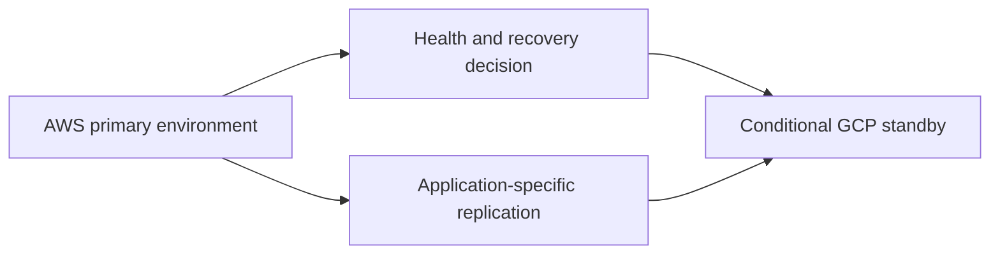

# Multi-Cloud Disaster Recovery Orchestrator

A plan-first Terraform reference for discussing a primary AWS environment and a conditional GCP standby environment. The useful part of this project is the decision process around recovery: what can be automated, what must be verified, and who authorises a failover.

> It is not a complete failover product. The current Terraform demonstrates infrastructure conditions only; data replication, application recovery, DNS routing, traffic validation, and failback require an application-specific design and drill.

## Architecture boundary



## What is in the repository

- Terraform inputs for AWS and GCP.
- A `dr_mode_active` switch for reviewing inactive and active standby plans.
- A non-production drill procedure in [`docs/DR_DRILL.md`](docs/DR_DRILL.md).
- Project notes that identify the recovery items Terraform does not solve by itself.

## Safe evaluation

```bash
cd terraform
cp terraform.tfvars.example terraform.tfvars
terraform fmt -check -recursive
terraform init
terraform validate
terraform plan -var='dr_mode_active=false'
terraform plan -var='dr_mode_active=true'
```

Compare both plans with a peer before applying in a disposable environment. Record actual recovery time, data gaps, and the runbook steps that were missing. Those observations are more useful than claiming an untested RTO or cost figure.
